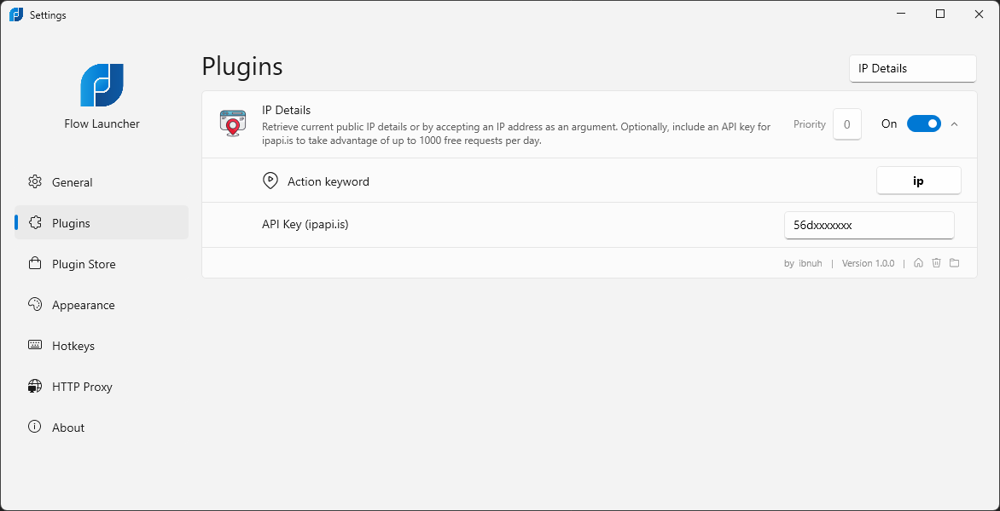

# Flow.Launcher.Plugin.IPDetails

A plugin for the [Flow launcher](https://github.com/Flow-Launcher/Flow.Launcher).

Retrieve current public IP details/lookup or by providing an IP address. Optionally, include an API key for ipapi.is to take advantage of up to 1000 free requests per day.

IP requests are cached for 24 hours to disk inside the Flow Launcher plugin directory to prevent unnecessary requests to the API and to speed up the response time.


## Usage

| Command             | Remarks                                          |
| ------------------- | ------------------------------------------------ |
| `ip`                | Get the Public IP address of the current machine |
| `ip <ipv4-address>` | Get the Public IP address of the specified IPv4  |

## Plugin Settings

An optional API Key field is provided in the settings to get more free requests for Public IP lookup. Sign up to [api.ipapi.is](https://ipapi.is) to get the API key.



## Development

For development, you can use the following command to build the plugin and copy it to the Flow Launcher plugin
directory. This script will allow you to test the plugin by doing these steps:

1. Build the plugin
2. Stop the Flow Launcher process
3. Copy the plugin to the plugin directory
4. Start the Flow Launcher process

```powershell
.\release.ps1
```

## Integrations

1. [api.ipapi.is](https://ipapi.is)
2. [ipv4.icanhazip.com](https://ipv4.icanhazip.com)

## Icons

IP Icons created by [Design Cirlce - Flaticon](https://www.flaticon.com/free-icons/ip)
